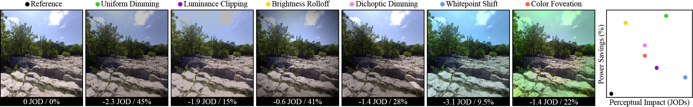

# <ins>PEAPODs</ins>: <ins>P</ins>erceptual <ins>E</ins>valuation of <ins>A</ins>lgorithms for <ins>P</ins>ower <ins>O</ins>ptimization in XR <ins>D</ins>isplay<ins>s</ins>

[Project Webpage](https://kenchen10.github.io/projects/sig24/index.html) | [Paper PDF](https://kenchen10.github.io/assets/papers/peapods_manuscript.pdf)



This work is explained in detail in:

>PEA-PODs: Perceptual Evaluation of Algorithms for Power Optimization in XR Displays.
Kenneth Chen, Thomas Wan, Nathan Matsuda, Ajit Ninan, Alexandre Chapiro*, Qi Sun*.
Published in ACM Transactions on Graphics (TOG), Volume 43, Issue 4, presented at SIGGRAPH 2024.
https://dl.acm.org/doi/10.1145/3658126

## Abstract
Display power consumption is an emerging concern for untethered devices. This goes double for augmented and virtual extended reality (XR) displays, which target high refresh rates and high resolutions while conforming to an ergonomically light form factor. A number of image mapping techniques have been proposed to extend battery usage. However, there is currently no comprehensive quantitative understanding of how the power savings provided by these methods compare to their impact on visual quality. We set out to answer this question.

To this end, we present a perceptual evaluation of algorithms (PEA) for power optimization in XR displays (PODs). Consolidating a portfolio of six power-saving display mapping approaches, we begin by performing a large-scale perceptual study to understand the impact of each method on perceived quality in the wild. This results in a unified quality score for each technique, scaled in just-objectionable-difference (JOD) units. In parallel, each technique is analyzed using hardware-accurate power models.

The resulting JOD-to-Milliwatt transfer function provides a first-of-its-kind look into tradeoffs offered by display mapping techniques, and can be directly employed to make architectural decisions for power budgets on XR displays. Finally, we leverage our study data and power models to address important display power applications like the choice of display primary, power implications of eye tracking, and more.

## Startup Guide

1. Clone the repository and cd into it:

```
git clone --recurse-submodules https://github.com/NYU-ICL/pea-pods.git
cd pea-pods
```

2. Create a new conda environment and activate it:
```
conda create -n peapods python=3.10
conda activate peapods
```

3. Install required dependencies:
```
pip install -r requirements.txt
```

## Example Usage
We include several base implementations for PEA and POD modalities in `pypeapods/PEA` and `pypeapods/POD`. For this example, we apply uniform dimming to a test image at a 50% power saving rate, measured by the global LC display power model. This code is also included in `pypeapods/peapods_example.py`.

```python
import imageio.v3 as iio
import numpy as np

import utils
from PEA.PEA_uniformdimming import UniformDimming
from PODs.PODs_globalLC import GlobalLC

os.makedirs('output/frames', exist_ok=True)

# load an image
pth = "data/study_imgs/Sculpture1.png"
image = utils.srgb2rgb(iio.imread(pth)/255)

# define PEA and POD
globalLC = GlobalLC(measurements_pth="data/mqp_display/mqp_BLU.csv", name="Global Dimming LC")
uniformdimming = UniformDimming(color="limegreen", name="Uniform Dimming")

# compute eccentricity map
H, W = 1800, 1920
xv, yv = np.meshgrid(np.linspace(0, W, W), np.linspace(0, H, H))
dist = ((xv - W/2) ** 2 + (yv - H/2) ** 2) ** .5

# define display parameters
display_params = {
    "ppd": 22,
    "foveal_region": 10,
    "FOV": 110,
    "distance": dist,
    "save_frames": True,
    "resolution": [H, W]
}

# apply PEA modality (uniform dimming by alpha=50%)
alpha = 0.5
image_modulated = uniformdimming.evaluate(image, "globalLC_uniformDimming", alpha, **display_params)

# compute dynamic power consumption for modulated and reference image
_, power_modulated = globalLC.evaluate(image_modulated)
_, power_reference = globalLC.evaluate(image)

# compute savings
savings = (1 - power_modulated / power_reference) * 100 

# should print 50
print(str(savings) + "% savings")
```

## Plotting Transfer Functions

See `pypeapods/peapods_test.py` for an example for generating plots visualizing JODs vs. relative power savings.

## Data Availability

We provide PSF and power measurements for the Meta Quest Pro display (`pypeapods/data/mqp_display`), user study results (`pypeapods/data/study_results/`), and test images (`pypeapods/data/study_imgs`).

## Custom Usage

To adapt our code for your own purposes (e.g. different display power model, new display mapping technique, etc.), the `pypeapods/PEA/PEA_Base.py` and `pypeapods/PODs/PODs_Base.py` classes can be overloaded, e.g. for comparison with our dataset.

## Study Test Images

We include frustums from the [LIVE-Facebook Technologies-Foveated / Compressed VR VQA Database](https://live.ece.utexas.edu/research/LIVEFBTFCVR/index.html) in `pypeapods/data/study_imgs`, which are used in our work to compute power savings. A copyright notice of the dataset is included at `pypeapods/data/study_imgs/copyright.txt`. Please see the notice before using these images in your work.

## Contact
Contact [Kenneth Chen](https://kenchen10.github.io) ([kennychen@nyu.edu](mailto:kennychen@nyu.edu)) with any questions.

## Acknowledgements
The authors would like to thank Cole Williams for conducting the user study, and John Hill, Cameron Wood, and Helen Ayele for coordinating it. We thank Alex Klement for providing the display module and relevant power data, Henry Milani for EE support and for providing the oscilloscope, Zhao Dong for providing the HTC VIVE Pro Eye, and Yongmin Park for providing PSF measurements. Thanks go to Takahiro Doi and Saeideh Ghahghaeinezamabadi for preliminary data related to dichoptic dimming, Yuta Asano for deriving the brightness rolloff curve, and Christopher Reidy for discussions about compute power. We are grateful to Ken Koh and Yu-Jen Lin for Unity support, Eric Fest for power model discussions, Michael Vaganov, Karsten Behrendt, and Ross Ning for eye tracking support, and Minjung Kim for help with logistics. Finally, we thank all the user study participants for their time. This project is partially supported by the National Science Foundation grants #2225861 and #2232817.

## Bibtex
If this repository was useful to you, please cite our work: 
```
 @article{ 
    chen2024peapods,
    author = {Chen, Kenneth and Wan, Thomas and Matsuda, Nathan and Ninan, Ajit and Chapiro, Alexandre and Sun, Qi},
    title = {PEA-PODs: Perceptual Evaluation of Algorithms for Power Optimization in XR Displays},
    year = {2024},
    issue_date = {July 2024},
    publisher = {Association for Computing Machinery},
    address = {New York, NY, USA},
    volume = {43},
    number = {4},
    issn = {0730-0301},
    url = {https://doi.org/10.1145/3658126},
    doi = {10.1145/3658126},
    journal = {ACM Trans. Graph.},
    month = {jul},
    articleno = {67},
    numpages = {17},
 } 
```